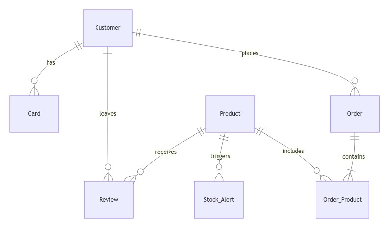

# Guitar e-commerce database

Database designed for a guitar e-commerce platform of a specific guitar manufacturer. 

## Scope

This database covers the essential aspects expected of an e-commerce platform:

* Customers, including basic identifying information
* Products, including their category, price and availability
* Reviews, including rating and comment
* Orders, including their status, payment method and the list of products bought (through the use of a link table)
* Cards, including the necessary identifying information
* Stock Alerts, including a message detailing which product is low on stock and the amount of units left.

Multiple shippers, discount coupons and product returns are, for simplicity, out of scope in this iteration. For the same reason, ENUMs are used for product categories and payment methods; in a real-world database, they would both have their own dedicated table to ensure scalability. 

## Functional Requirements

This database supports:

* CRUD operations for administrators
* Browsing products for customers
* Placing orders for customers
* Reading and leaving reviews for customers
* Stock monitoring via alerts for administrators

## Representation

Entities are captured in MySQL tables with the following schema.

### Entities

The database includes the following entities:

#### Customers

The `customers` table includes:

* `id`, which specifies the unique ID for the customer as an `INT UNSIGNED` with `AUTO_INCREMENT`. This column thus has the `PRIMARY KEY` constraint applied.
* `first_name`, which specifies the customer's first name as `VARCHAR(64)` allowing names up to 64 characters long.
* `last_name`, which specifies the customer's last name as `VARCHAR(64)`  allowing last names up to 64 characters long.
* `email_address`, which specifies the customer's email address as `VARCHAR(255)` accommodating email addresses of varying lengths. A `UNIQUE` constraint ensures no two customers have the same email address.
* `password`, which specifies the customer's password. Since it's hashed using bcrypt or similar, `CHAR(60)` is used.
* `shipping_address`, which specifies the customer's default shipping address as `TEXT`, accommodating addresses from any country in the world.
* `wallet_balance`, which specifies the customer's wallet balance as a `DECIMAL(8,2)`, allowing balances up to $999999.99.

With the exception of the default `shipping_address`, all columns in the `customers` table are required and hence should have the `NOT NULL` constraint applied. No other constraints are necessary.

#### Cards

The `cards` table includes:

* `id`, which specifies the unique ID for the card as an `INT UNSIGNED` with `AUTO_INCREMENT`. This column thus has the `PRIMARY KEY` constraint applied.
* `customer_id`, which specifies the ID of the customer who owns the card as an `INT UNSIGNED`. This column thus has the `FOREIGN KEY` constraint applied, referencing the `id` column in the `customers` table to ensure data integrity.
* `last_four_digits`, which specifies the card's last four digits as `CHAR(4)`. Four digits is enough to help customers identify their cards while ensuring compliance with common security best-practices.
* `expiration_date`, which specifies the card's expiration date as `DATE`, for customer's convenience.
* `payment_token`, which specifies the payment token as `VARCHAR(255)`, for integrations with payment gateways.

`customer_id` and `last_four_digits` are required and hence should have the `NOT NULL` constraint applied. No other constraints are necessary.

#### Products

The `products` table includes:

* `id`, which specifies the unique ID for the product as an `INT UNSIGNED` with `AUTO_INCREMENT`. This column thus has the `PRIMARY KEY` constraint applied.
* `name`. which specifies the name to identify the product as `VARCHAR(256)`, allowing a wide array of descriptive names.
* `category`, which specifies the category to which the product belongs as a `ENUM` with the following options: 'Electric', 'Acoustic', 'Acoustic-Electric' and 'Bass'.
* `price`, which specifies the price of the product as a `DECIMAL(8,2)`, allowing prices up to $999999.99.
* `quantity_available`, which specifies the units of the product that are currently available for sale as an `INT UNSIGNED`.
* `low_stock_threshold`, which specifies the number of units below which the product is considered to be low on stock as an `INT UNSIGNED`. Used to trigger stock alerts.

With the exception of `low_stock_threshold`, all columns in the `products` table are required and hence should have the `NOT NULL` constraint applied. No other constraints are necessary.

#### Reviews

The `reviews` table includes:

* `id`, which specifies the unique ID for the product as an `INT UNSIGNED` with `AUTO_INCREMENT`. This column thus has the `PRIMARY KEY` constraint applied.
* `product_id`, which specifies the ID of the product reviewed as an `INT UNSIGNED`. This column thus has the `FOREIGN KEY` constraint applied, referencing the `id` column in the `products` table to ensure data integrity.
* `customer_id`, which specifies the ID of the customer reviewing the product as an `INT UNSIGNED`. THIS column thus has the `FOREIGN KEY` constraint applied, referencing the `id` column in the `customers` table to ensure data integrity.
* `rating`, which specifies the rating given by the customer as a `TINYINT`, chosen because very little memory is necessary for this piece of data, as the rating is just a number between 1 and 5 (as ensured by the `CHECK` function).
* `comment`, which specifies the comment written by the customer as `TEXT`, allowing detailed reviews.
* `created_at`, which specifies the date and time the review was left as a `TIMESTAMP`. The default value is the current timestamp, as denoted by `DEFAULT CURRENT_TIMESTAMP`.

With the exception of `comment`, all columns in the `reviews` table are required and hence should have the `NOT NULL` constraint applied.
A `UNIQUE` constraint is applied to both `product_id` and `customer_id` (combined), to avoid review spamming on a product by the same customer.

#### Orders

The `orders` table includes:

* `id`, which specifies the unique ID for the order as an `INT UNSIGNED` with `AUTO_INCREMENT`. This column thus has the `PRIMARY KEY` constraint applied.
* `customer_id`, which specifies the ID of the customer who placed the order as an `INT UNSIGNED`. This column thus has the `FOREIGN KEY` constraint applied, referencing the `id` column in the `customers` table to ensure data integrity.
* `payment_method`, which specifies the payment method used as an `ENUM` with the following options: `wallet` and `card`.
* `order_status`, which specifies the status of the order as an `ENUM` with the following options: 'Pending', 'Shipped', 'Completed' and 'Cancelled'.
* `placed_at`, which specifies the date and time the order was placed as a `TIMESTAMP`. The default value is the current timestamp, as denoted by `DEFAULT CURRENT_TIMESTAMP`.
* `shipping_address`, which specifies the address to ship the order to as `TEXT`, accommodating addresses from any country in the world.

All columns in the `orders` table are required and hence should have the `NOT NULL` constraint applied.

#### Stock alerts

The `stock_alerts` table includes:

* `id`, which specifies the unique ID for the alert as an `INT UNSIGNED` with `AUTO_INCREMENT`. This column thus has the `PRIMARY KEY` constraint applied.
* `product_id`, which specifies the ID of the product that triggered the alert as an `INT UNSIGNED`. This column thus has the `FOREIGN KEY` constraint applied, referencing the `id` column in the `products` table to ensure data integrity.
* `alert_message`, which specifies the alert message as a `VARCHAR(255)`, allowing the necessary details to be logged.
* `created_at`, which specifies the date and time the alert was created as a `TIMESTAMP`. The default value is the current timestamp, as denoted by `DEFAULT CURRENT_TIMESTAMP`.

All columns in the `stock_alerts` table are required and hence should have the `NOT NULL` constraint applied.

#### Order products (Link table)

The `order_products` table includes:

* `order_id`, which specifies the ID of the order that includes these products as an `INT UNSIGNED`. This column thus has the `FOREIGN KEY` constraint applied, referencing the `id` column in the `orders` table to ensure data integrity.
* `product_id`, which specifies the ID of the product ordered as an `INT UNSIGNED`. This column thus has the `FOREIGN KEY` constraint applied, referencing the `id` column in the `products` table to ensure data integrity.
* `quantity`, which specifies the amount of product ordered as an `INT UNSIGNED`.
* `price_at_order`, which specifies the price of the product at the time of order as a `DECIMAL(8,2)`, allowing prices up to $999999.99.

All columns in the `order_products` table are required and hence should have the `NOT NULL` constraint applied.

### Relationships

The below entity relationship diagram describes the relationships among the entities in the database.

As detailed by the diagram:

* One customer can place zero or many orders. This is a one-to-many relationship where a customer can have multiple orders over time, but an order must belong to exactly one customer.
* One customer can have zero or many cards. This is a one-to-many relationship where each customer can have multiple saved payment cards, but a card is tied to exactly one customer.
* One customer can leave zero or many reviews. Each customer can submit multiple reviews, but each review belongs to exactly one customer.
* One product can receive zero or many reviews. Multiple customers can review the same product, but each review is tied to only one product.
* One product can trigger zero or many stock alerts. A product can generate multiple alerts as its stock levels fluctuate, but each alert refers to one specific product.
* One order can contain one or many products of varying quantities. This many-to-many relationship is handled by the `order_products` link table, which associates each order with multiple products. Many products can be included in zero or many orders. Each product may appear in multiple orders, and an order can include multiple products.

## Optimizations

### Indexes

Per the typical queries in `queries.sql`:

* Upon customer login, to quickly fetch customer information, an index is created on the `email_address` column of `customers`.
* It is common for customers to browse products by their name or category. For that reason, indexes are created on the `name` and `category` columns of `products` to speed the search of products by those columns.
* To quickly display the average rating of products, an index is created on the `product_id` column of `reviews`.
* To allow quick access to a customer's order history, an index is created on the `customer_id` column of `orders` as well as composite index combining the `order_id` and `product_id` columns of the `order_products` table.

### Views

* `product_sales_summary` aggregates sales data for each product, showing how many units have been sold and the total revenue generated. It provides quick insights into the performance of individual products and it helps administrators plan restocking efforts for high-demand products. It's also useful for tracking the lifecycle of products by analyzing their sales and revenue over time.
* `customer_reviews` provides a detailed list of customer reviews, including the customer’s name, the product reviewed, the rating, and the comment. This data can be leveraged to display reviews on the product pages and it's useful for understanding customer sentiment about different products. It can help the support team to address common issues and the marketing team to promote highly-rated products.
* `daily_sales` aggregates daily sales data, showing the total number of orders and the revenue generated per day. It helps identify trends in sales volume and revenue over time.
* `top_rated_products` shows products that have received the highest average ratings from customers. This data can be displayed on the website to guide customers toward highly-rated products and it can inform decisions about which products to continue developing, promoting, or phasing out.

## Limitations

This schema would require a few more tables to be able to support multiple shippers, discount coupons and product returns.

Furthermore, using dedicated tables for product categories and payment methods, rather than ENUMs, would make it much easier to accomodate new categories and payment methods.

Finally, in production environments, additional security measures would be needed to handle credit cards and payments.

